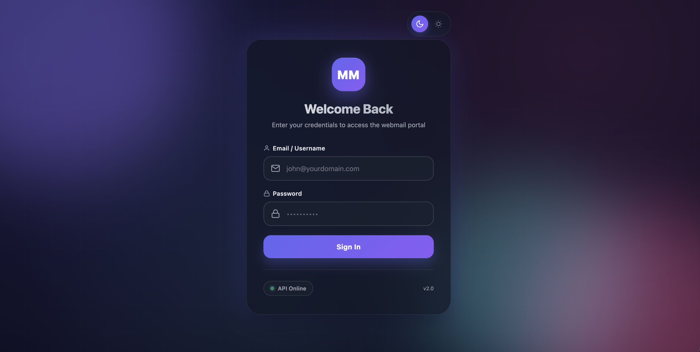

= MaM (Multi Access Mail) Portal (Zimbra / Carbonio)
:sectnums:

A lightweight portal to authenticate users against *Zimbra / Carbonio* (via SOAP) and redirect them to webmail using *Preauth*.
Includes a built-in *Admin Dashboard* to manage servers and admin users.

[.text-center]

== Features

=== User Portal
* Login with *email/username + password*
* Domain-based routing to the correct *Zimbra / Carbonio* server
* Webmail redirect using *Preauth* (no need to type password again in webmail)
* Supports *multiple servers* + fallback order

=== Admin Dashboard
* Manage Zimbra / Carbonio servers (add/edit/delete)
* Domain mapping per server
* Test connection (SOAP auth check)
* Manage admin users (passwords stored as bcrypt hashes)
* Session-based admin login

=== Ops / Security
* Config stored in `config.ini` (not committed)
* Optional TLS for the portal itself (HTTPS mode)
* Optional custom CA file for Zimbra internal certificates
* Login attempts logged to `data/login_attempts.jsonl`
* File-based session store in `data/sessions/`

== Requirements
* Node.js *18+* (LTS recommended)
* npm
* Zimbra / Carbonio server with:
** SOAP endpoint reachable
** Preauth enabled + Preauth key available

== Quick Start (Local)

=== 1) Install dependencies
[source,bash]
----
npm install
----

=== 2) Create config.ini
[source,bash]
----
cp config.sample.ini config.ini
----

Edit `config.ini` and define at least one server section (`[ZetaKey_1]`).

=== 3) Start the server
[source,bash]
----
npm run start
----

Open:
* User portal: `http://localhost:8080/`
* Admin dashboard: `http://localhost:8080/admin/`

== Admin Account

Create an admin user:
[source,bash]
----
npm run create-admin
----

Admin users are stored in:
* `data/admin_users.json`

TIP: Use a strong password and keep `data/` out of Git.

== Configuration Guide (config.ini)

=== Minimal example
[source,ini]
----
[DEFAULT]
default_domain = example.com

[WEB]
https_enabled = false
http_port = 8080
https_port = 8443
tls_key_file = certs/server.key
tls_cert_file = certs/server.crt

[ADMIN]
base_path = /admin
session_secret = CHANGE_ME_SESSION_SECRET

[ZetaKey_1]
name = Zimbra / Carbonio Primary
server = https://mail1.example.com
domains = example.com,example.co.id
preauthkey = CHANGE_ME_PREAUTH_KEY
soap_path = /service/soap
preauth_path = /service/preauth
; ca_file = certs/internal-ca.pem
; insecure_tls = false
----

=== Notes
* Server keys must follow: `ZetaKey_<number>` (e.g. `ZetaKey_1`, `ZetaKey_2`)
* `domains` is a comma-separated list.
* You can use `*` as a wildcard fallback domain.
* `default_domain` will be appended if user logs in using username only (no `@domain`).

=== Carbonio compatibility
Carbonio can work the same way as Zimbra as long as the SOAP and preauth endpoints are compatible.
If your Carbonio endpoints differ, adjust:
* `soap_path`
* `preauth_path`

== Admin UI Development (Optional)

Run backend + admin UI dev server:
[source,bash]
----
npm run dev:backend   # Express backend on :8080
npm run dev           # Vite admin UI on :5173
----

Admin UI:
* `http://localhost:5173/admin/`

Or run both:
[source,bash]
----
npm run dev:all
----

Build admin UI into `public/admin/`:
[source,bash]
----
npm run build
----

== Production Notes
* Put the portal behind a reverse proxy (Nginx/Caddy) if needed.
* Always set a strong `session_secret` in `[ADMIN]`.
* Do not commit:
** `config.ini`
** `data/`
** `certs/`

== Troubleshooting

=== Login succeeds but redirect fails
* Verify `preauthkey` is correct
* Ensure server time is synced (NTP) on both portal and Zimbra/Carbonio
* Confirm `preauth_path` matches your server

=== SOAP auth fails
* Confirm `soap_path` is correct (`/service/soap` is common)
* If using internal/self-signed cert:
** set `ca_file = certs/internal-ca.pem`
** or (dev only) set `insecure_tls = true`

=== Domain routing not working
* Make sure domain is listed in `domains` (lowercase recommended)
* Add `domains = *` on your fallback server to catch unmatched domains

