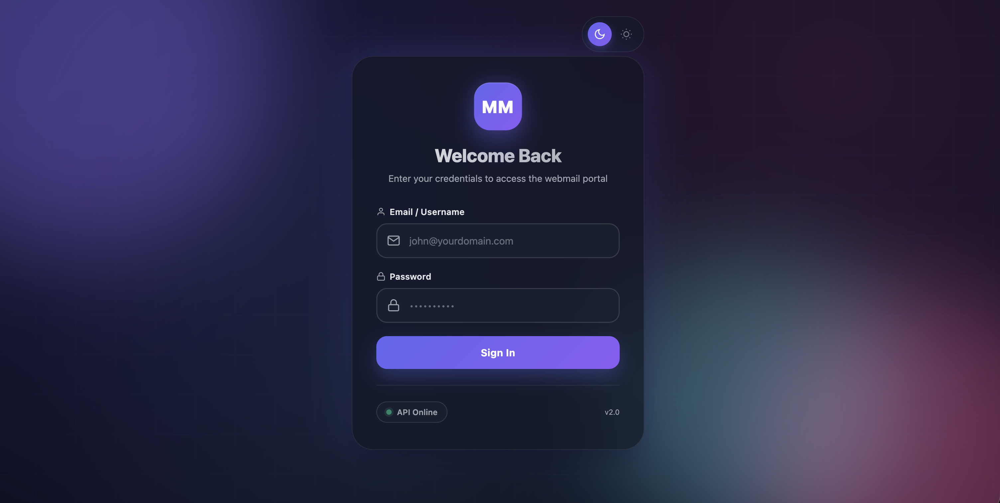

= MaM (Multi Access Mail) Portal (Zimbra / Carbonio)
:sectnums:

A lightweight portal to authenticate users against *Zimbra / Carbonio* using *SOAP* and redirect them to webmail with *Preauth*.
It also includes a built-in *Admin Dashboard* to manage servers, domains, and admin users.

[.text-center]

== Features

=== User Portal
* Login using *email/username + password*
* Domain-based routing to the correct *Zimbra / Carbonio* server
* Seamless webmail redirect using *Preauth*
* Supports *multiple servers* with fallback order

=== Admin Dashboard
* Manage Zimbra / Carbonio servers
* Map domains to each server
* Test SOAP authentication connectivity
* Manage admin users
* Passwords stored as *bcrypt hashes*
* Session-based admin login

=== Operations / Security
* Configuration stored in `config.ini`
* Optional TLS / HTTPS support
* Optional custom CA file for internal certificates
* Login attempts logged to `data/login_attempts.jsonl`
* File-based admin session storage in `data/sessions/`
* Helper script `start.sh` for bootstrap, start, stop, restart, and status

== Requirements
* Node.js *18+* (LTS recommended)
* npm
* Zimbra / Carbonio server with:
** Reachable SOAP endpoint
** Preauth enabled
** Valid Preauth key

== Project Structure

[source,text]
----
.
├── config.sample.ini
├── config.ini
├── package.json
├── server.js
├── public/
├── data/
│   ├── admin_users.json
│   ├── login_attempts.jsonl
│   └── sessions/
├── logs/
├── start.sh
└── certs/
----

== Quick Start

=== 1) Install dependencies
[source,bash]
----
npm install
----

=== 2) Create configuration
[source,bash]
----
cp config.sample.ini config.ini
----

Edit `config.ini` and define at least one server section such as `[MaMKey_1]`.

=== 3) Create admin account
[source,bash]
----
npm run create-admin
----

=== 4) Start the application
[source,bash]
----
npm run start
----

Open:

* User portal: `http://localhost:8080/`
* Admin dashboard: `http://localhost:8080/admin/`

== Start Script Helper

The project includes a helper script named `start.sh` to simplify installation, bootstrap, and runtime operations.

=== What `start.sh` does
On first run, it can:

* Detect the operating system
* Install Node.js and npm if missing
* Run `npm install`
* Run `npm run build`
* Run `npm run create-admin`
* Start the application

On later runs, it will:

* Start the application directly without re-running install/build/admin creation
* Only re-run bootstrap if explicitly requested

=== Default admin credentials
By default, the helper script creates:

* Username: `admin`
* Password: `admin`

You should change this immediately after first use in a real environment.

=== Make script executable
[source,bash]
----
chmod +x start.sh
----

=== Basic usage
[source,bash]
----
./start.sh
./start.sh start
./start.sh stop
./start.sh restart
./start.sh status
./start.sh help
----

=== Run modes
[source,bash]
----
./start.sh start --background
./start.sh start --foreground
----

=== Manual bootstrap
Use this when you want to force dependency installation and rebuild manually:

[source,bash]
----
./start.sh bootstrap
----

=== Force bootstrap before start
[source,bash]
----
./start.sh start --force-bootstrap
----

=== Logs

* Application log: `logs/app.log`
* Bootstrap log: `logs/bootstrap.log`

=== PID file

* Application PID file: `app.pid`

=== Bootstrap state
The script uses a bootstrap marker file:

* `.bootstrap.done`

This prevents `npm install` and `npm run build` from running every time after a simple stop/start cycle.

If you want to reset bootstrap state manually:
[source,bash]
----
rm -f .bootstrap.done
----

== Admin Account

Admin users are stored in:

* `data/admin_users.json`

TIP: Use a strong password and make sure `data/` is not committed to Git.

== Configuration Guide (`config.ini`)

=== Minimal example
[source,ini]
----
[DEFAULT]
default_domain = example.com

[WEB]
https_enabled = false
http_port = 8080
https_port = 8443
tls_key_file = certs/server.key
tls_cert_file = certs/server.crt

[ADMIN]
base_path = /admin
session_secret = CHANGE_ME_SESSION_SECRET

[MaMKey_1]
name = Zimbra / Carbonio Primary
server = https://mail1.example.com
domains = example.com,example.co.id
preauthkey = CHANGE_ME_PREAUTH_KEY
soap_path = /service/soap
preauth_path = /service/preauth
; ca_file = certs/internal-ca.pem
; insecure_tls = false
----

=== Notes

* Server sections must use the format: `MaMKey_<number>`
* Example: `MaMKey_1`, `MaMKey_2`
* `domains` must be a comma-separated list
* You can use `*` as a wildcard fallback domain
* `default_domain` will be appended if a user logs in with username only

=== Carbonio compatibility
Carbonio generally works the same as Zimbra as long as SOAP and Preauth endpoints are compatible.

If needed, adjust:

* `soap_path`
* `preauth_path`

== Admin UI Development

Run backend and admin UI separately in development mode:

[source,bash]
----
npm run dev:backend
npm run dev
----

Default URLs:

* Backend: `http://localhost:8080/`
* Admin UI (Vite): `http://localhost:5173/admin/`

Or run both together:
[source,bash]
----
npm run dev:all
----

Build the admin UI into `public/admin/`:
[source,bash]
----
npm run build
----

== Production Notes

* Place the portal behind a reverse proxy such as *Nginx* or *Caddy*
* Always set a strong `session_secret` in `[ADMIN]`
* Do not commit the following:
** `config.ini`
** `data/`
** `certs/`
** `logs/`
** `.bootstrap.done`
** `app.pid`

=== Recommended reverse proxy setup
In production, it is recommended to:

* Terminate HTTPS at Nginx or Caddy
* Forward traffic to the Node.js app running on the configured HTTP port
* Restrict admin access if necessary

== Troubleshooting

=== The application starts but stop does not fully kill it
If the Node process becomes detached from `npm`, use:
[source,bash]
----
./start.sh stop
----

The helper script will also try to detect and stop orphan processes using the configured app match pattern.

If needed, adjust:
[source,bash]
----
APP_MATCH="node server.js" ./start.sh status
APP_MATCH="node dist/server.js" ./start.sh stop
----

=== Login succeeds but redirect fails

* Verify `preauthkey` is correct
* Ensure server time is synchronized with NTP
* Confirm `preauth_path` matches the actual server endpoint

=== SOAP authentication fails

* Confirm `soap_path` is correct
* If using self-signed or internal certificates:
** set `ca_file = certs/internal-ca.pem`
** or for development only set `insecure_tls = true`

=== Domain routing is not working

* Ensure the domain is listed in `domains`
* Lowercase domain values are recommended
* Add `domains = *` to the fallback server if needed

=== `start.sh` runs install/build every time
This usually means bootstrap state is missing.

Check whether `.bootstrap.done` exists:
[source,bash]
----
ls -lah .bootstrap.done
----

If it does not exist, bootstrap will run again on next start.

=== `create-admin` fails during bootstrap
This may happen if:

* the admin user already exists
* the prompt flow differs from the expected input
* custom scripts behave differently in your environment

In that case, create or update the admin manually:
[source,bash]
----
npm run create-admin
----

== Recommended `.gitignore`
Make sure these entries exist in `.gitignore`:

[source,text]
----
config.ini
data/
certs/
logs/
app.pid
.bootstrap.done
----

== License
See the link:LICENSE[LICENSE] file for details.
